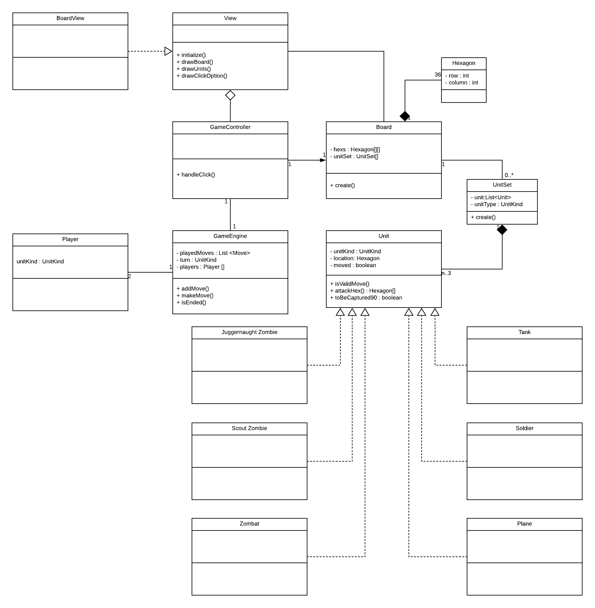

# Red Alert 2 Board Game

A Command & Conquer themed board game for RMIT course Object Orientated Software Design Assignment 1 & 2.

## Participants & Contribution

- Johnny Huynh - 33%
- Chee Wei Low - 33%
- Udahakapugedara Madhusanka Senadhi - 33%
- Stanley Elliott - 0%

## How it works

The project is a 2D gameBoard game using different shapes from standard squares on the board.

We have units that can move depending on their unit behaviour by clicking and moving units on the board. This is similar to a traditional chess game but with a few twists!


### Gameplay

The game is predetermined by configs at runtime to layout players and pieces on the board.

Game can only start with a **minimum of 2 players**. Players can select and move units once on a rotating turn.

Combat in units is similar to a chess game where units can conquer other pieces on the gameBoard, however this is **limited by specified winnable units**. Units can be set to a defensive status which disallows other units to attack them at the cost of **one move**. 

To win a game, the player with the **most amount of units** wins after a certain amount of turns or if the **player is the last one standing**.

## Development Environment

In order to run this we need to match these requirements:

- Any OS
- Java version **11** SDK
- Eclipse or IntelliJ (my bias says IntelliJ 😅)
- A love for Red Alert 2

### Running the game

There are specific ways to start up this game depend on which IDE you use.

#### Eclipse

Make sure you do not have any other gameBoard game copies on your system.

- Pull the project from **GitHub desktop**
- Import an existing **Maven** project `Maven > Existing Maven Projects`
- Right click on the project and go to `Maven > Update Project`
- Right click on the top status menu `Run > Run Configurations...`
- Create a `Maven Build` step with the following **goals**

```$xslt
clean install exec:java
``` 

#### IntelliJ

- Pull the project from **GitHub desktop**
- Import the project from Maven
- Right click on the top status menu `Run > Edit Configurations...`
- Create a `Maven` step with the following `command line`

```$xslt
clean install exec:java
``` 

## Analysis

We've produced a few class diagrams to show our iterative process in developing the game.

### Class diagram V1



### Current class diagram


### Mouse click handling on gameBoard sequence diagram

We've created a sequence diagram describing the game piece handling a mouse click.


